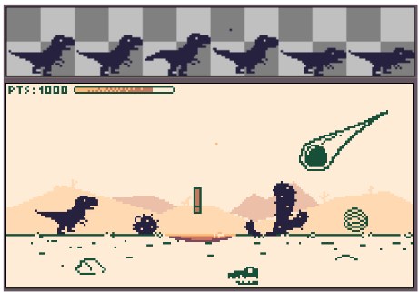
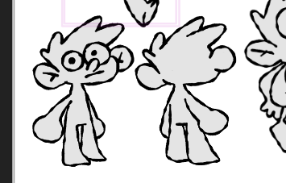
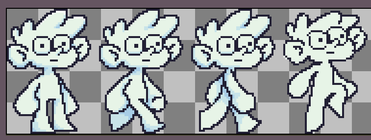
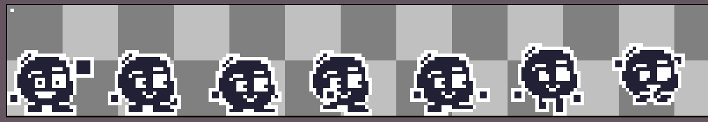

📝 Dev Log: Projeto Plataforma (Godot)
Bem-vindo ao dev log oficial deste projeto! Este repositório documenta a jornada de desenvolvimento de um jogo de plataforma criado com o objetivo de colocar em prática os conceitos estudados na engine Godot.

Nota inicial: O projeto começou de forma diferente e passou por algumas evoluções importantes de escopo e identidade visual até chegar ao estado atual. Abaixo está o registro cronológico dos primeiros 3 dias de desenvolvimento.

🦖 Dia 1: O Ponto de Partida (O Incidente "Dinomorph")
O projeto começou no dia 5 com a ideia inicial de criar um endless runner com dinossauros (estilo o jogo do dinossauros do Google Chrome). Cheguei a estruturar conceitos visuais e sprites iniciais para esse projeto (que se chama provisoriamente de Dinomorph e continua vivo, voltando à ativa assim que este jogo de plataforma for concluído).

Como o curso que estou seguindo aborda o desenvolvimento de jogos de plataforma, decidi pivotar o foco do projeto para aplicar diretamente os novos conhecimentos.

Foco do dia: Aprendizado dos fundamentos da Godot (scripts básicos, sistema de animação e colisões).

Resultados ao fim do dia:

Criação de um protótipo de terreno usando caixas de colisão básicas (sem texturas).

Implementação do player temporário (ainda um dinossauro) com estados de animação para Static, Walking e Jumping.

📸 Mídia do Dia 1

Concepts do dino: 

Gameplay Inicial (Caixas de colisão): <video src="docs/media/video_dia1.mp4" controls width="100%"></video>

😐 Dia 2: A Chegada de Bob e a Exploração de Câmera
O segundo dia foi de "pouco avanço" estrutural devido à mudança de direção. Para não gastar os sprites dos dinossauros e acabar criando algo reciclado, decidi trazer um personagem de outro projeto futuro do JAM labs: o Bob.

O Bob foi originalmente criado para ser o protagonista do Desem Forca (evolução direta e mobile do projeto anterior Em Forca, já concluído e disponível na Play Store). A ideia inicial era introduzir o humor e a falta de carisma dele aqui. Porém, como comecei a descobrir o software Aseprite, percebi que ainda não tenho técnica para animar um personagem tão detalhado.

Ainda assim, criei os sprites de Standing, Walking e Jumping para ele (que ficaram até que legais, eu acho).

Foco do dia:

Testar os limites com o Aseprite criando os sprites do Bob.

Experimentação com caixas de colisão para criar uma pseudo-fase explorável.

Implementação do sistema de câmera centralizada com efeito smooth.

📸 Mídia do Dia 2

Concepts do Bob: 

Spritesheet do Bob: 

Gameplay com o Bob: <video src="docs/media/video_dia2.mp4" controls width="100%"></video>

🟢 Dia 3: O Hamster na Bola, o Nascimento do "Blob" e Texturas
No terceiro dia, pensei em mudar de rota novamente: imaginei um jogo sobre um hamster fugindo de casa em sua bola, focando em momentum e alta velocidade usando o terreno. Novamente, vi que o escopo e a criação de sprites fugiam da minha capacidade técnica atual.

Explorando minha galeria de concepts antigos (inclusive ideias descartadas durante a criação do Bob), encontrei o personagem perfeito: uma criatura em formato de bolha preta com braços flutuantes e uma carinha fofa. Ele é carismático, fácil de animar e encaixou perfeitamente no projeto de plataforma.

Foco do dia:

Criação dos sprites definitivos para o personagem (incluindo a animação de Falling).

Refinamento da física do personagem.

Estudos iniciais sobre terreno, posicionamento do eixo Z e ajustes finos na câmera.

Primeira aplicação de texturas no mapa.

📸 Mídia do Dia 3

Sprites do novo personagem (Blob): 

Gameplay atual com mapa texturizado: <video src="docs/media/video_dia3.mp4" controls width="100%"></video>

🛠️ Tecnologias e Ferramentas
Engine: Godot Engine

Arte / Animação: Aseprite

Organização: JAM labs