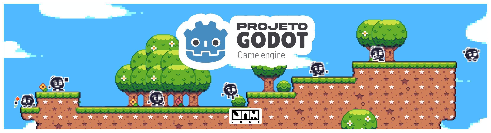
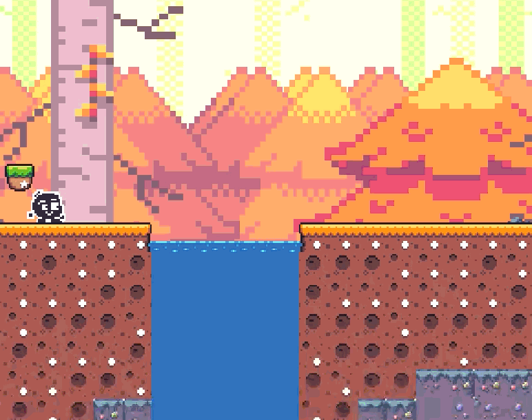
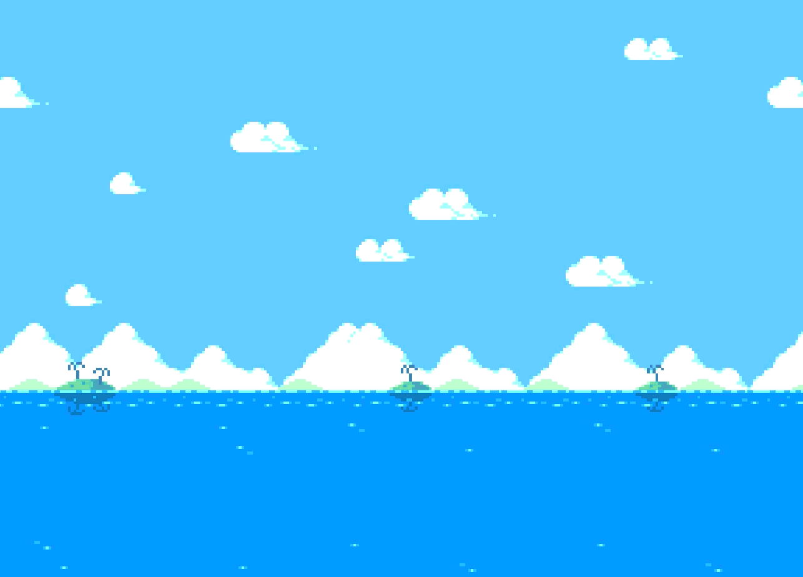
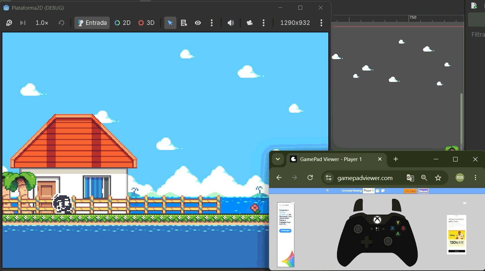
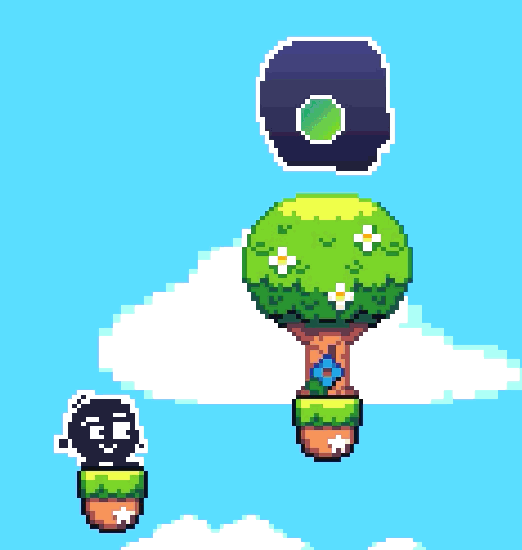
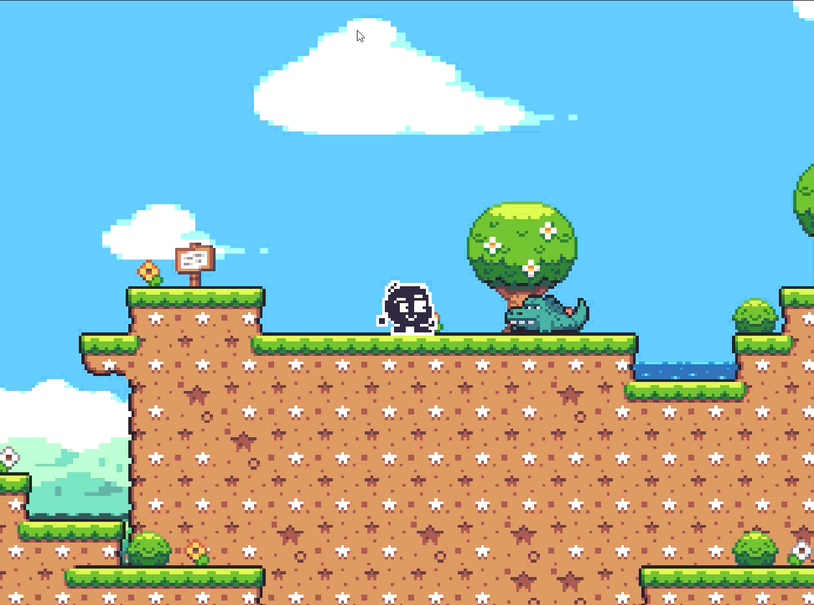
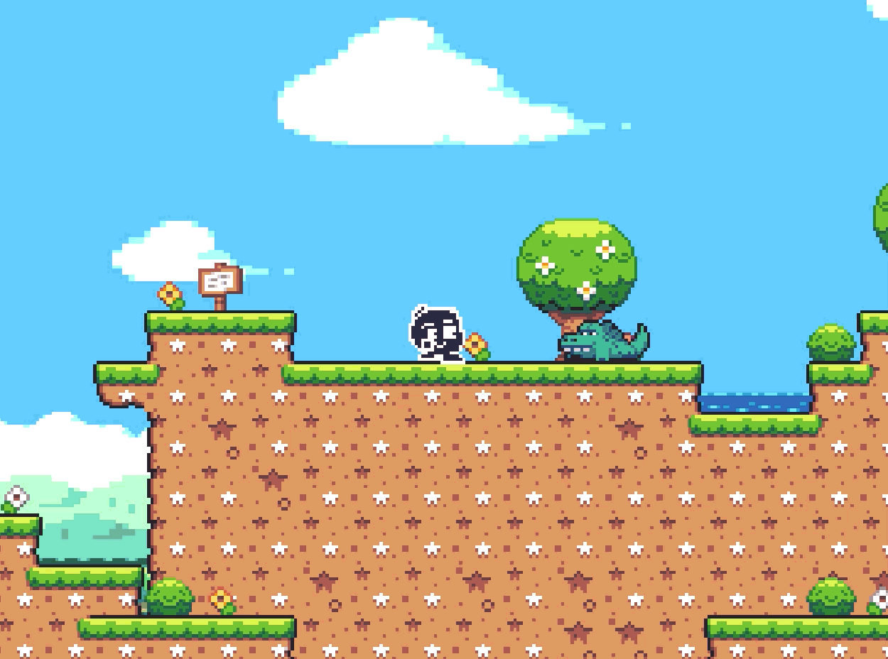
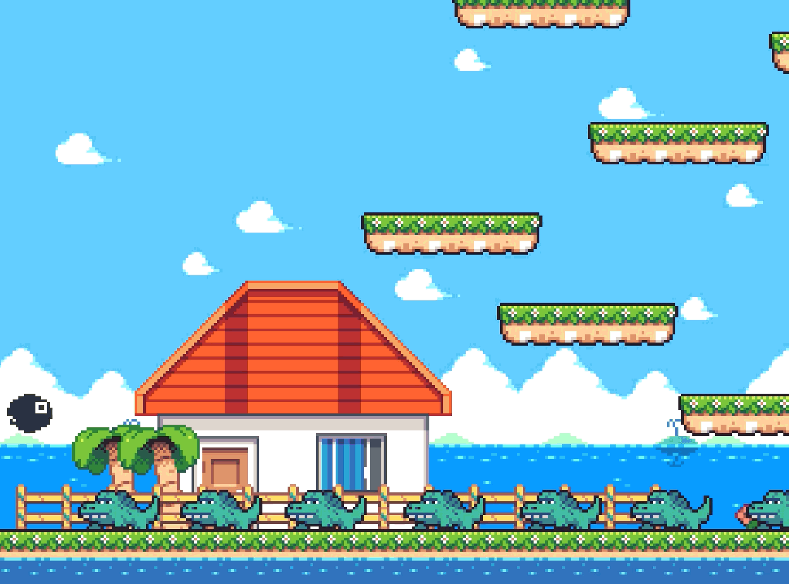

# 📝 Dev Log: Projeto Plataforma (Godot)

Bem-vindo ao dev log oficial deste projeto! Este repositório documenta a jornada de desenvolvimento de um jogo de plataforma criado com o objetivo de colocar em prática os conceitos estudados na engine Godot.

> **Nota inicial:** O projeto começou de forma diferente e passou por algumas evoluções importantes de escopo e identidade visual até chegar ao estado atual. Abaixo está o registro cronológico do desenvolvimento.

---

## 🎯 Introdução e Objetivos

O projeto Godot tem como principal objetivo me ajudar nos estudos da engine, servindo para testes e aprendizado prático. Diferente do *Em Forca*, não há a intenção inicial de entregar um projeto concreto, finalizado ou publicado na Play Store. 

Durante o desenvolvimento, precisarei criar APKs para testar o funcionamento do jogo em um aparelho mobile. Esses APKs poderão ser disponibilizados dentro do repositório para download público, mas não são o foco principal. O devlog serve para que eu, como programador, possa ver minha evolução prática em cada etapa do desenvolvimento.

Apesar de não focar na publicação por agora, o projeto será feito com total esmero e boas práticas. O objetivo no momento é gerar e solidificar o aprendizado para aplicá-lo em projetos futuros (como o *Morphossaur*), mas sempre existe a possibilidade de mudar de ideia e publicar o jogo caso ele alcance solidez suficiente para isso.

---

## 🗂️ Índice
* [Introdução e Objetivos](#-introdução-e-objetivos)
* [Dia 1: O Ponto de Partida (O Incidente "Morphossaur")](#-dia-1-o-ponto-de-partida-o-incidente-morphossaur)
* [Dia 2: A Chegada de Bob e a Exploração de Câmera](#-dia-2-a-chegada-de-bob-e-a-exploração-de-câmera)
* [Dia 3: O Hamster na Bola, o Nascimento do "Blob" e Texturas](#-dia-3-o-hamster-na-bola-o-nascimento-do-blob-e-texturas)
* [Dia 4: Ambientação, Camadas e o Efeito Parallax](#-dia-4-ambientação-camadas-e-o-efeito-parallax)
* [Dia 5: Pouco Tempo, Nova Cena e Água Animada](#-dia-5-pouco-tempo-nova-cena-e-água-animada)
* [Dia 6: Suporte a Controles, Background Animado e a Batalha do Parallax](#-dia-6-suporte-a-controles-background-animado-e-a-batalha-do-parallax)
* [Dia 7: Câmera Desacoplada, Portais e Transição de Fases](#-dia-7-câmera-desacoplada-portais-e-transição-de-fases)
* [Dia 8: Transição de Fases Totalmente Funcional](#-dia-8-transição-de-fases-totalmente-funcional)
* [Dia 9: Polimento Visual e Animação de Spawn do Jogador](#-dia-9-polimento-visual-e-animação-de-spawn-do-jogador)
* [Tecnologias e Ferramentas](#%EF%B8%8F-tecnologias-e-ferramentas)
* [Dia 10: Refatoração da Máquina de Estados e Novas Movimentações](#-dia-10-refatoração-da-máquina-de-estados-e-novas-movimentações)

---

## 🦖 Dia 1: O Ponto de Partida (O Incidente "Morphossaur")

O projeto começou no dia 5 de setembro de 2026 com a ideia inicial de criar um endless runner com dinossauros (estilo o jogo do dinossauros do Google Chrome). Cheguei a estruturar conceitos visuais e sprites iniciais para esse projeto (que se chama provisoriamente de Morphossaur e continua vivo, voltando à ativa assim que este jogo de plataforma for concluído).

Como o curso que estou seguindo aborda o desenvolvimento de jogos de plataforma, decidi pivotar o foco do projeto para aplicar diretamente os novos conhecimentos.

**Foco do dia:** 
* Aprendizado dos fundamentos da Godot (scripts básicos, sistema de animação e colisões).

**Resultados ao fim do dia:**
* Criação de um protótipo de terreno usando caixas de colisão básicas (sem texturas).
* Implementação do player temporário (ainda um dinossauro) com estados de animação para Static, Walking e Jumping.

### 📸 Mídia do Dia 1

---

## 🎥 Dia 2: A Chegada de Bob e a Exploração de Câmera

O segundo dia foi de "pouco avanço" estrutural devido à mudança de direção. Para não gastar os sprites dos dinossauros e acabar criando algo reciclado, decidi trazer um personagem de outro projeto futuro do JAM labs: o Bob.

O Bob foi originalmente criado para ser o protagonista do Desem Forca (evolução direta e mobile do projeto anterior Em Forca, já concluído e disponível na Play Store). A ideia inicial era introduzir o humor e a falta de carisma dele aqui. Porém, com minha experiência de 1 hora de Aseprite, percebi que ainda não tenho técnica para animar um personagem tão detalhado (sei da regra de fazer funcionar primeiro e deixar bonito depois, mas definir o personagem principal do jogo é importante para saber como o jogo deve se comportar e eu não garanto que eu vá conseguir aprender a fazer bons sprites até o final do desenvolvimento, até pq, esse não é o foco do projeto).

Ainda assim, criei os sprites de Standing, Walking e Jumping para ele (que ficaram até que legais, eu acho).

**Foco do dia:**
* Testar os limites com o Aseprite criando os sprites do Bob.
* Experimentação com caixas de colisão para criar uma pseudo-fase explorável.
* Implementação do sistema de câmera centralizada com efeito smooth.

### 📸 Mídia do Dia 2
<table>
  <tr>
    <td width="33%"> Concepts do Bob</td>
    <td width="33%"> Spritesheet do Bob</td>
    <td width="33%"> Gameplay com o Bob</td>
  </tr>
</table>

---

## 🐹 Dia 3: O Hamster na Bola, o Nascimento do "Blob" e Texturas

No terceiro dia, pensei em mudar de rota novamente: imaginei um jogo sobre um hamster fugindo de casa em sua bola, focando em momentum e alta velocidade usando o terreno. Novamente, vi que o escopo e a criação de sprites fugiam da minha capacidade técnica atual.

Explorando minha galeria de concepts antigos (inclusive ideias descartadas durante a criação do Bob), encontrei o personagem perfeito: uma criatura em formato de bolha preta com braços flutuantes e uma carinha fofa. Ele é carismático, fácil de animar e encaixou perfeitamente no projeto de plataforma.

**Foco do dia:**
* Criação dos sprites definitivos para o personagem (incluindo a animação de Falling).
* Refinamento da física do personagem.
* Estudos iniciais sobre terreno, posicionamento do eixo Z e ajustes finos na câmera.
* Primeira aplicação de texturas no mapa.

### 📸 Mídia do Dia 3
<table>
  <tr>
    <td width="50%"> Sprites do novo personagem (Blob)</td>
    <td width="50%"> Primeira versão do terreno de testes</td>
  </tr>
</table>

---

## 🌄 Dia 4: Ambientação, Camadas e o Efeito Parallax

O quarto dia foi focado 100% em ambientação e em entender como estruturar um mapa de verdade. Percebi rápido que, para um jogo de plataforma focado em exploração (que é o caminho que quero seguir com esse projeto ainda sem nome), dividir o mapa em camadas não é só capricho, é essencial.

Também assimilei bem melhor a lógica de tilesets, a importância de separar tiles em objetos específicos e como organizar tudo isso de forma limpa na Godot. Com isso, resolvi reestruturar o mapa todo: mantive o mesmo layout que já tinha gostado, mas refiz do zero aplicando camadas organizadas, refinando as hitboxes de colisão, adicionando detalhes de cenário para dar mais vida e seguindo boas práticas de level design.

Para fechar o dia com chave de ouro, implementei um background definitivo e configurei o efeito de Parallax, aplicando diferentes intensidades de movimento de acordo com a profundidade e distância de cada camada. A sensação de profundidade mudou completamente o jogo! (mas definitivamente, minhas tecnicas com o paralax ainda tem muito a melhorar)

**Foco do dia:**
* Estudo prático de Tilemaps, divisão de objetos em tiles e organização em camadas (layers).
* Reestruturação completa do mapa de testes mantendo o layout, mas com hitboxes refinadas e detalhes de ambientação.
* Implementação de background com Parallax em múltiplas velocidades para criar sensação real de profundidade.

### 📸 Mídia do Dia 4
<table>
  <tr>
    <td width="50%"> Mapa reestruturado com camadas</td>
    <td width="50%"> Camadas de Parallax e Ambientação</td>
  </tr>
</table>

---

## 🌊 Dia 5: Pouco Tempo, Nova Cena e Água Animada

O quinto dia acabou sendo mais enxuto por pura falta de tempo, mas ainda assim deu para aprender algo muito massa. Como o tempo de tela foi curto, o foco acabou sendo bem cirúrgico: entender como funciona a animação de tiles na Godot.

Comecei montando uma nova cena de testes bem rápida para não bagunçar o mapa anterior. Depois de apanhar um pouquinho para pegar a lógica (e tentar relembrar tudo que eu tinha aprendido nos dias anteriores), consegui criar os frames e aplicar animação para a água do cenário. Mesmo parecendo um detalhe pequeno, foi bacaninha aprender a animar isso (Quero tentar fazer isso para simular uns efeitos de vento nas plantas e tal) e acho que fecha bem os estudos com tilesets animados.

**Foco do dia:**
* Criação de uma nova cena de testes ágil para prototipagem rápida.
* Estudo e implementação de animação de tiles dentro do TileMap.
* Adição de água animada ao cenário.

### 📸 Mídia do Dia 5

---

## 🎮 Dia 6: Suporte a Controles, Background Animado e a Batalha do Parallax

No sexto dia, configurei o mapeamento de inputs para controles de console. Agora, as ações do player (que por enquanto continuam focadas no essencial: andar e pular) já respondem liso tanto no teclado quanto no controle. 

Também aprendi a fazer animação de cenário diretamente no background e montei uma nova cena para testar tudo. Por outro lado, o dia foi marcado por uma dor de cabeça que vem me perseguindo: o ajuste fino dos backgrounds. 

Está sendo a minha maior dificuldade no projeto. Nunca consigo acertar de primeira e deixar tudo 100% polido. Sempre que tento alinhar o BG dos três mapas criados até agora, acabo tendo que apelar para gambiarras, esticar sprites e caçar resoluções no improviso. Mesmo assim, sinto que o enquadramento ou o efeito de parallax ficam ligeiramente desalinhados. É um ponto fraco que com certeza vou precisar parar para estudar com mais calma nos próximos dias.

**Foco do dia:**
* Implementação do suporte e mapeamento de inputs para controles de console.
* Estudo de técnicas de animação diretamente no cenário (background).
* Criação de uma nova cena de testes.

### 📸 Mídia do Dia 6
<table>
  <tr>
    <td width="50%"> Novo cenário com background animado</td>
    <td width="50%"> Teste prático com controle de console</td>
  </tr>
</table>

---

## 🌀 Dia 7: Câmera Desacoplada, Portais e Transição de Fases

O sétimo dia foi focado em refatoração e preparação de sistemas importantes para a progressão do jogo. 

Comecei o dia reformulando completamente o sistema de câmera. No início, ela era apenas um nó filho do jogador, então entrava em cena e o seguia de forma automática sempre que o player era instanciado no cenário. No geral isso funciona bem para testes rápidos, mas percebi que iria me limitar ou complicar a vida mais à frente caso eu precisasse, por exemplo, focar a câmera em outros pontos ou objetos durante eventos específicos da gameplay. 

Para resolver isso, desacoplei tudo: criei uma nova cena exclusiva para a câmera e a configurei como uma entidade própria. Agora ela possui comportamento independente e segue o jogador via script. Feito isso, importei a câmera nos 3 cenários e fiz os ajustes finos para que ela performe da melhor forma em cada mapa.

Depois, comecei a trabalhar no sistema de troca de fases. Para deixar a transição visualmente clara e intuitiva, desenhei um sprite animado no Aseprite e estruturei o portal em uma cena própria na Godot — configurando suas animações e scripts de comportamento. Aproveitei esse momento para me aprofundar em conceitos fundamentais da engine: passei a explorar melhor as tags/grupos, configurei as collision layers e collision masks com mais precisão e comecei a utilizar sinais (signals) para disparar eventos de forma limpa. Por fim, posicionei e "escondi" o portal pelos 3 mapas já criados para começar a amarrar a exploração entre as fases.

**Foco do dia:**
* Refatoração e desacoplamento da câmera, transformando-a em uma cena/entidade independente com perseguição via script.
* Ajustes e calibração da nova câmera nos 3 cenários existentes.
* Criação dos sprites e animações do portal no Aseprite.
* Estudo e aplicação de Collision Layers/Masks, tags/grupos e sinais (signals) na Godot.
* Configuração da cena do portal e posicionamento pelos mapas para estruturar a transição entre fases.

### 📸 Mídia do Dia 7

---

## 🚪 Dia 8: Transição de Fases Totalmente Funcional

No oitavo dia, o tempo disponível foi curto e os avanços foram pontuais, mas o que deu para implementar é essencial para a estrutura de qualquer jogo de plataforma: o sistema de troca de fases está oficialmente funcional!

Aproveitei a cena do portal criada no dia anterior e configurei a lógica para disparar a troca de mapa assim que o jogador entra na área. A solução ficou bem simples e modular: usei uma variável dinâmica exportada diretamente no nó, o que permite definir individualmente para qual fase o portal vai levar sem precisar criar um script diferente para cada cenário. É uma mecânica muito interessante, direta ao ponto e que já abriu minha mente para novas ideias de como estruturar a progressão de fases de um jeito ainda mais criativo no *Morphossaur*.

**Foco do dia:**
* Implementação da lógica de transição entre cenas ao colidir com o portal.
* Uso de variáveis dinâmicas exportadas no Inspector para tornar o portal reutilizável em qualquer fase.
* Validação do fluxo de navegação entre os mapas do projeto.

### 📸 Mídia do Dia 8

---

✨ Dia 9: Polimento Visual e Animação de Spawn do Jogador

No nono dia, resolvi fazer uma pequena pausa no cronograma das aulas para focar em experiência de usuário (UX) e polimento visual. A troca de mapas já estava funcionando, mas a transição parecia muito abrupta: o jogador simplesmente "surgia" do nada na nova cena.

Para resolver isso, criei uma animação de abertura para o portal no início de cada fase. Estruturei um script próprio para essa transição com uma lógica bem amarrada:
1. O portal busca o jogador na cena utilizando o grupo **"Player"**.
2. Ao encontrá-lo, posiciona o personagem exatamente no centro da abertura.
3. Esconde o sprite do jogador e desativa temporariamente seus controles, movimento e gravidade.
4. Executa a animação de surgimento e, assim que ela termina, revela o player e reativa toda a sua física.
5. Caso a fase não possua um nó do tipo jogador, o script dispara um alerta de erro amigável no console.

O resultado deixou a entrada nas fases bem mais fluida

**Foco do dia:**
* Criação da animação e feedback visual de "spawn" (nascimento) do jogador no portal.
* Manipulação temporária de estados do player (invisibilidade e bloqueio de física/inputs) durante cutscenes curtas.
* Busca e validação dinâmica de nós na cena via Grupos/Tags (`"Player"`).
* Tratamento de exceções e erros no console caso o player não seja encontrado.

### 📸 Mídia do Dia 9
 

---

🧘 Dia 10: Refatoração da Máquina de Estados e Novas Movimentações

No décimo dia, o foco foi reestruturar a arquitetura do jogador para dar um salto na jogabilidade. O script antigo do player estava começando a ficar engessado, então fiz uma refatoração completa aplicando o conceito de **Máquina de Estados (Finite State Machine)** baseada em enums.

Com essa nova estrutura modular, o código ficou infinitamente mais limpo, desacoplado e fácil de expandir. Além dos estados clássicos de parada (*idle*), caminhada (*walk*) e pulo (*jump*), adicionei e configurei três novas mecânicas de movimentação:

1. **Agachar (*crouch*):** O personagem reduz sua hitbox ao se abaixar.
2. **Rolar (*roll*):** Ao mover o personagem enquanto estiver agachado, ele executa uma rolagem rápida com velocidade um pouco aumentada.
3. **Pulo Duplo (*double jump*):** Agora o jogador pode executar um segundo pulo no ar antes de tocar o solo. Para dar um charme visual, o segundo pulo substitui a animação padrão por um giro no ar!

**Foco do dia:**
* Reestruturação completa do script do player usando enums e máquina de estados (`idle`, `walk`, `jump`, `crouch`, `roll`)
* Implementação das mecânicas de agachar, rolar com impulso de velocidade e pulo duplo.
* Feedback visual dinâmico no ar: troca de animação para giro/roll durante o pulo duplo e controle do estado de queda.

### 📸 Mídia do Dia 10

---

## 🚀 Dia 11: Boost, Dive e a Câmera (Silenciosamente) Barulhenta

Me diverti tanto implementando a máquina de estados no dia anterior que resolvi brincar um pouco mais com a estrutura. Aproveitei a flexibilidade do código novo para adicionar dois novos estados de movimentação que dão muito mais dinâmica e velocidade para a gameplay: o **Boost** e o **Dive**.

O *Boost* é um impulso ativado ao manter o botão de pulo pressionado no exato momento em que o player encosta no chão após um pulo duplo. Já o *Dive* é um mergulho rápido e agressivo em direção ao solo, ativado se eu pressionar o botão de agachar enquanto estou no meio de um pulo duplo.

Para dar peso (*game feel*) a essas ações, adicionei uma dinâmica na câmera: ela sofre um *screen shake* (tremor) toda vez que o player inicia um *Boost* ou impacta o chão após um *Dive*. O único problema é que eu exagerei tanto no efeito que vou dormir com o ouvido doendo por conta do "estrondo" altíssimo que a câmera faz quando treme... detalhe: o jogo ainda não tem efeito sonoro😐

**Foco do dia:**
* Expansão da Máquina de Estados com duas novas mecânicas avançadas: Boost e Dive.
* Lógica de inputs combinados e janelas de ação (ativar comandos específicos logo após o pulo duplo).
* Implementação de *Screen Shake* na câmera para melhorar o *game feel* e o peso dos impactos.

### 📸 Mídia do Dia 11

---

## 🐊 Dia 12: Primeiros Inimigos, Jacarés e Interações de Combate

Os primeiros testes com inimigos começaram! Adicionei uma nova entidade ao projeto: um jacaré. Por enquanto, ele ainda não possui inteligência artificial para agir sozinho, mas já deixei toda a base visual preparada, com as animações de *idle*, *andar* e *ataque* devidamente configuradas.

Também organizei o projeto adicionando uma camada (layer) exclusiva de colisão para os inimigos e comecei a programar as interações diretamente no script do player. 

A interação entre o player e o inimigo acontece de forma bem dinâmica:
* Se o player atingir o jacaré usando as habilidades de `boost` ou `dive`, o inimigo é destruído (`queue_free()`) e a tela sofre um *camera shake* para dar peso ao impacto.
* Caso o player apenas caia sobre o inimigo, ele ganha um impulso vertical, recarregando o pulo.
* Se o player encostar no inimigo sem estar atacando ou caindo, ele transita para o novo estado de morte (`PlayerState.dead`).
* O estado de morte (`dead_state`) reproduz a animação de morte, treme a câmera e aplica uma força de repulsão diagonal (*knockback*) baseada na constante `KNOCKBACK_FORCE`.

**Foco do dia:**
* Criação da entidade do jacaré com sprites e animações base.
* Configuração da *Collision Layer* específica para Inimigos.
* Expansão da máquina de estados do player adicionando o estado `dead`.
* Implementação de interações de combate onde o resultado depende da movimentação atual do player (Boost/Dive/Falling vs. Dano).

### 📸 Mídia do Dia 12
<table>
  <tr>
    <td width="50%"> Player atacando com Boost/Dive</td>
    <td width="50%"> Player recebendo dano e Knockback</td>
  </tr>
</table>

---

## 🐊 Dia 13: Inteligência Artificial, RayCasts e a Morte "3D" do Jaré

O dia 13 foi focado em dar vida ao Jaré e em aprofundar os estudos com RayCasts, um conceito muito bacana e extremamente útil na engine. Agora, o jacaré não é apenas um sprite estático!

Para dar autonomia ao inimigo, implementei uma inteligência artificial básica baseada em estados (`idle`, `walk`, `bite`, `dead`) e nós do tipo `RayCast2D`. O Jaré agora patrulha o cenário de forma inteligente: ele usa detectores para identificar paredes à frente e buracos no chão, invertendo sua direção automaticamente para não cair ou travar. Além disso, adicionei um sensor frontal para detectar o jogador; caso o player entre no seu raio de visão, o Jaré interrompe a caminhada, desloca sua *hitbox* para frente para ganhar alcance e executa a mordida.

A parte mais divertida do dia foi refatorar a derrota do inimigo. Atualizei o script do player: em vez de simplesmente apagar o jacaré da existência com `queue_free()` durante um *Boost* ou *Dive*, o player agora chama a função `take_damage()` do inimigo. Isso aciona um efeito visual de arremesso "Fake 3D". O Jaré tem suas colisões desativadas, recebe um impulso caótico para o ar, e começa a girar rolando para trás enquanto sua escala aumenta progressivamente em direção à tela. Ao se aproximar da "lente da câmera", ele perde opacidade até sumir completamente e ser deletado da memória.

**Foco do dia:**
* Estudo prático e implementação de `RayCast2D` (`wall_detector`, `ground_detector`, `player_detector`) para navegação autônoma.
* Criação de IA de patrulha e sistema de detecção e ataque focado no player.
* Manipulação dinâmica de posição de colisão (*hitbox*) via código para sincronizar com a animação de ataque.
* Substituição da exclusão instantânea (`queue_free()`) do inimigo por uma chamada segura de dano (`take_damage()`) no script do player.
* Desenvolvimento de um efeito visual de morte com física simulada, rotação, ganho de escala (ilusão 3D) e desfoque (*fade out*).

### 📸 Mídia do Dia 13

---

## 🛠️ Tecnologias e Ferramentas
* **Engine:** Godot Engine
* **Arte / Animação:** Aseprite
* **Organização:** JAM labs
**Agradecimento Especial:** 
> Um agradecimento ao professor **[Rafael Forbeck](https://github.com/RafaelForbeck)** pelas aulas e pela didática fantástica durante o curso de Godot! 